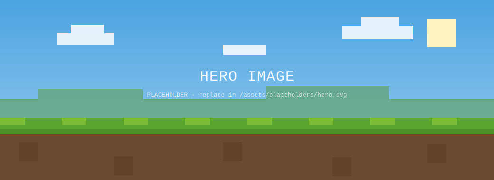

# Minecraft Launcher — Web Replica

A pixel-matched, browser-based replica of the **Minecraft Launcher** (Java Edition
"Play" screen). Built as static files so it can be hosted directly on
[githack](https://raw.githack.com/).



## What's inside

| Path | Purpose |
|------|---------|
| `index.html` | The launcher shell (sidebar, tabs, hero, PLAY bar, news row) |
| `css/launcher.css` | Pixel-matched styling |
| `js/launcher.js` | Tabs, sidebar, PLAY → game window. **`GAME_URL` config lives here.** |
| `js/news.js` | Fetches **real Minecraft news & patch notes** from Mojang, live |
| `assets/hero-art.png` | Pixel-exact hero art (front layer) matching the launcher crop |
| `assets/hero.webp` | Full key-art (back layer, fills the sliver revealed under the Realm panel) |
| `assets/icons/{bedrock,dungeons,dungeons2}` | Real block/fire/eye textures for the sidebar game icons |
| `assets/ui/play-button.png` | Real green pixel **PLAY** button (trimmed) |
| `assets/ui/minecraft-logo.png` | Real **MINECRAFT · JAVA EDITION** logo (the hero header) |
| `assets/ui/gift.png` | Real "Give the gift of Minecraft" + **Buy as Gift** ad |
| `assets/ui/gamepass.png` | Real **Included with PC GAME PASS** badge |
| `assets/icons/java.webp` | Real isometric grass-block Java Edition icon |
| `assets/icons/*` | Block/UI icons as **PNG** (with the `.svg` sources kept alongside) |
| `assets/fonts/*` + `css/fonts.css` | Self-hosted fonts (Pixelify Sans, Press Start 2P, Noto Sans) — no external dependency |
| `assets/placeholders/*` | Placeholder news / realm images (news is replaced live from Mojang) |
| `game/index.html` | **Drop-in slot for the actual game build** |

## Hosting on githack

githack serves any file in a public GitHub repo with the right content type — no
build step. After you push this branch, the launcher is live at:

```
https://raw.githack.com/lauraevan/mclauncherrep/claude/minecraft-launcher-replica-bakqq2/index.html
```

- Swap the branch segment for `main` (or a tag/commit SHA) once merged.
- Use `rawcdn.githack.com/...` instead of `raw.githack.com/...` for the
  cached/production CDN URL.

## The game (novix core 26.1.2)

When **PLAY** is pressed the launcher loads the game into a full-screen
`<iframe>`. The 82 MB build is hosted on catbox, so `GAME_URL` at the top of
`js/launcher.js` points at it:

```js
var GAME_URL = "https://files.catbox.moe/olevzn.html";
```

- While the large file downloads, a **loading spinner** is shown; it hides once
  the game finishes loading.
- If the host ever sends a frame-blocking header, the **"Open in new tab"**
  button in the game window opens the build directly instead.
- To use a different build, just change `GAME_URL` (any HTTPS URL, or a local
  `game/index.html`). Served over HTTPS on githack, so the target must be HTTPS.

## Real Minecraft "mail" (news & patch notes)

`js/news.js` pulls live content from Mojang's official, CORS-enabled launcher
content API — the same source the real launcher uses:

- News cards → `https://launchercontent.mojang.com/news.json`
- Patch Notes tab → `https://launchercontent.mojang.com/v2/javaPatchNotes.json`

These run in the visitor's browser, so they populate automatically when the page
is opened online. If the network is unavailable, the UI falls back to placeholder
cards so it never looks broken.

## Assets

The hero key art, the **MINECRAFT · JAVA EDITION** logo header, the green **PLAY**
button and every sidebar icon use the real assets (`assets/hero.webp`,
`assets/ui/*`, `assets/icons/*.png`). News-card images populate live from Mojang;
only the realm-tab art and the offline news fallback remain placeholder SVGs in
`assets/placeholders/`.

## Local preview

Any static file server works, e.g.:

```bash
python3 -m http.server 8000
# then open http://localhost:8000/
```
